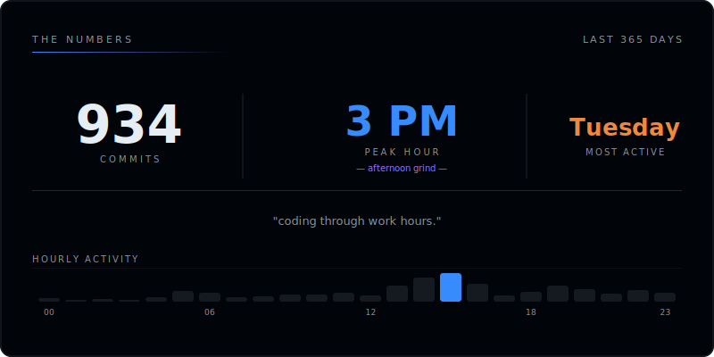
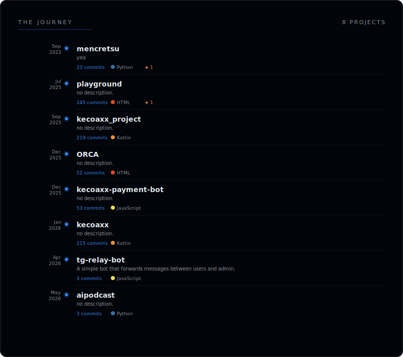
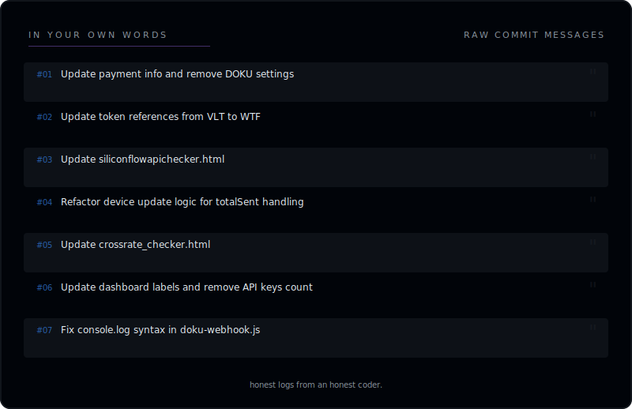

  

 

**mencretsu** &mdash; software person. writes code at weird hours. ships things. sometimes breaks things. usually fixes them.

&nbsp;

<!-- ── skills / badges  ─────────────────────────── -->

<!-- ── stats in 
 ──────────────────────── -->

&nbsp;

---

&nbsp;

&nbsp;

&nbsp;

&nbsp;

&nbsp;

---

auto-updated daily via github actions &nbsp;&middot;&nbsp; data pulled from github api &nbsp;&middot;&nbsp; all svgs hand-coded
